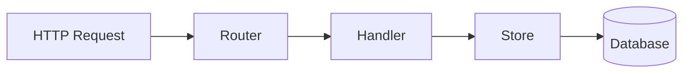

# Architecture Documentation

## Overview

This project implements a RESTful Product Catalog API in Go.

The application supports CRUD operations for products and uses either an in-memory store or a PostgreSQL database for persistence.

## Request Flow

## Flow Explanation

1. A client sends an HTTP request.
2. Gorilla Mux routes the request to the correct handler.
3. The handler processes and validates the request.
4. The handler calls the store layer.
5. The store reads or writes data.
6. The response is returned as JSON.

## MemoryStore vs. PostgresStore

| MemoryStore | PostgresStore |
|---|---|
| Stores data in memory | Stores data in PostgreSQL |
| Fast and simple | Persistent storage |
| No setup required | Requires database setup |
| Data is lost after restart | Data survives restarts |
| Good for testing | Good for production |

## When to use each

### MemoryStore

Useful for:
- unit tests
- local development
- simple demos

### PostgresStore

Useful for:
- persistent data
- Docker Compose setup
- production-like environments

## Trade-offs

MemoryStore is simpler and faster, but data is not persistent.

PostgresStore is more complex, but it provides reliable long-term storage.